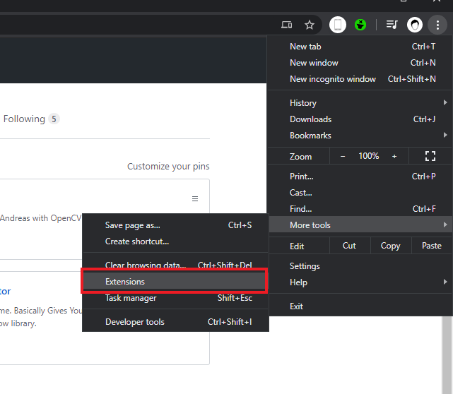
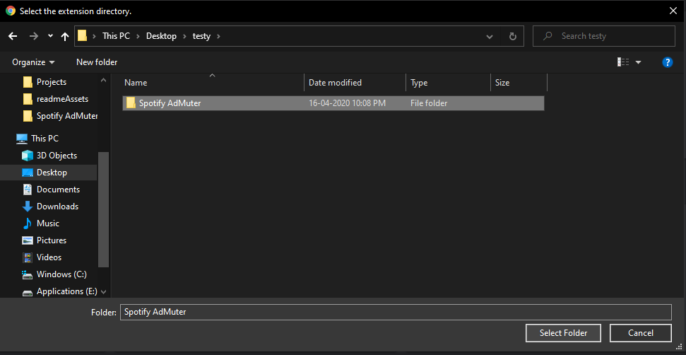
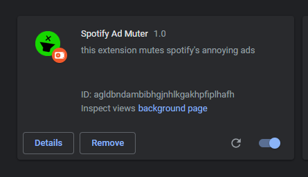

# Spotify-AdMuter  [[Download]](https://github.com/AeroAndZero/Spotify-AdMuter/releases/download/v1.0/Spotify-AdMuter.zip)
 A Google Chrome extension that mutes spotify's ads.         
 Notice : This extension won't *remove* spotify's ads it will just mute them. u gotta pay for no ads :)      
 
 ## How To Install :
 - Download the .zip file from [here](https://github.com/AeroAndZero/Spotify-AdMuter/releases/download/v1.0/Spotify-AdMuter.zip)
 - After you have downloaded it, extract it somewhere
 - Now Open Google Chrome then go to settings -> more tools -> Extension                 
            
 - Then enable developer option from the top-right corner        
 - Then Click on Load Unpacked button         
 - Locate and select the extracted folder like this :             
           
 - And Now you are done ! it should look like this :             
                 
                    
                    
#### Sorry spotify but I would really like to listen to your ads if they weren't cringy :)
